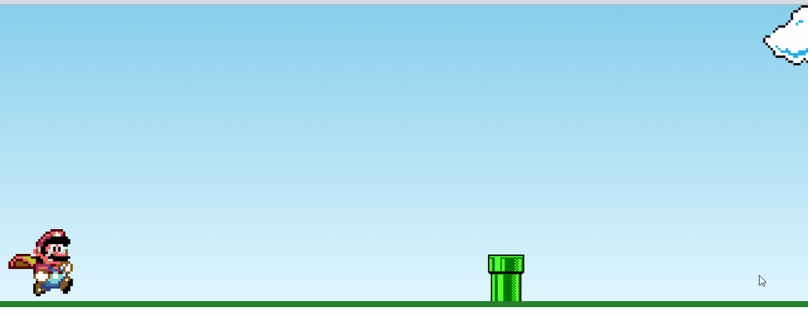

  

  
  
   
  
  

_Para a versão em Português, clique [aqui](#portuguese)._ 

### Topics

- [Project description](#project-description)

- [Technologies used](#technologies-used)

- [What I learned](#what-I-learned)

- [How to access the Project and play](#how-to-access-the-project-and-play) 

- [The result](#the-result)

- [Future improvements](#future-improvements)

## Project description

  This project was created to train animations with JavaScript. It is a 'Mario Bros.' mini-game that simulates the character's challenge to jump over pipes so that he does not lose lives in the game, which happens if the character touches the pipe.

## Technologies used

  
  
  

## What I learned

- How to make the CSS animation (which makes the character jump) work 'in a loop' (inserting and removing the class in the CSS) with an arrow function in JS that uses the add method + the CSS class to call the class, the setTimeout function (which uses the time set in the CSS) + the remove method to insert and remove the class in the CSS when the key is pressed;
- How to use JS to access the style in the CSS, using the style + the name of the animation (in the keyframe) and check the distance between the character and the pipe thus calculating when to stop the game (character lost a life) using a template literals + the position of the pipe + position of the character (with getComputedStyle method).

## How to access the Project and play

You can [access the project here](https://caroline-barbosa-vilar.github.io/mario-js/) 

- To play, you need to press the 'keyUp' key on your keyboard when Mario is getting close to the pipe, and hold the key down until the pipe is completely through him.
- If Mario does not jump the pipe in time the game ends, in this case refresh the page to load the game again.

## The result 

Desktop:

## Future improvements

- Fixed the clouds bug;
- Shown the 'Game over' message when the character touches the pipe;
- Make the background look more like the 'real one' in the game;
- Insert some sort of a soundtrack.

  

  

  

  
  
   
 
   

  
  
### Tópicos 

- [Descrição do projeto](#descrição-do-projeto)

- [Tecnologias utilizadas](#tecnologias-utilizadas)

- [O que aprendi](#o-que-aprendi)

- [Como acessar o projeto e jogar](#como-acessar-o-projeto-e-jogar)
  
- [O resultado](#o-resultado)  

- [Futuras melhorias](#futuras-melhorias)

  
  
## Descrição do projeto 

  Este projeto foi criado para treinar animações com JavaScript. É um mini-jogo do 'Mario Bros.' que simula p desafio do personagem de pular os canos para que não perca vidas no jogo, o que acontece se o personagem encostar no cano.

  
  
## Tecnologias utilizadas

  
  
  

  
  
## O que aprendi

- Como fazer a animação do CSS (que faz o personagem pular) funcionar 'em loop' (inserindo e removendo a classe no CSS) com uma arrow function no JS que usa o método add + a classe do CSS para chamar a classe, a função setTimeout (que usa o tempo setado no CSS) + o método remove para inserir e remove a classe no CSS quando a tecla for pressionada;
- Como usar o JS para acessar o estilo no CSS, usando o style + o nome da animação (no keyframe) e verificar a distância entre o personagem e o cano calculando assim quando parar o jogo (personagem perdeu uma vida) usando um template literals + a posição do cano + posição do personagem (com método getComputedStyle).

  
## Como acessar o projeto e jogar

Você pode [acessar o projeto aqui](https://caroline-barbosa-vilar.github.io/mario-js/)
  
- Para jogar é preciso pressionar a tecla keyUp do teclado quando chegar próximo ao cano e manter pressionada até que o cano passe por completo. 
- Caso o Mario não pule o cano a tempo o jogo termina, nesse caso dar um refresh na página para carregar o jogo novamente. 

  
  
## O resultado  

Desktop:

  
## Futuras melhorias
  
- Corrigir o bug nas nuvens;
- Mostrar a mensagem de 'game over' quando o personagem tocar o cano;
- Fazer o background mais parecido com o do vide-game;
- Inserir a musiquinha do video-game de fundo.  

Developed with 🧡 by me!  [Carol Vilar](https://www.linkedin.com/in/carolinebarbosavilar/)
